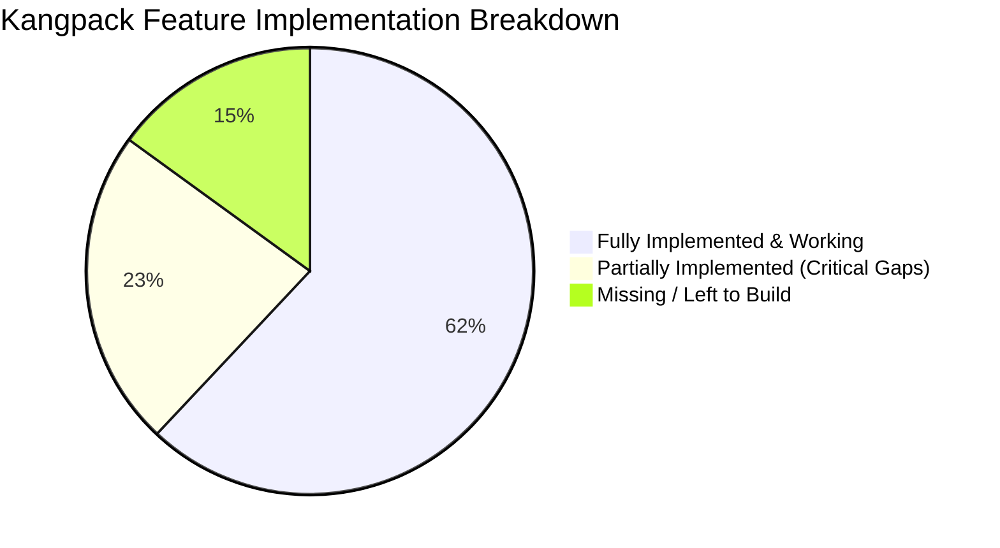
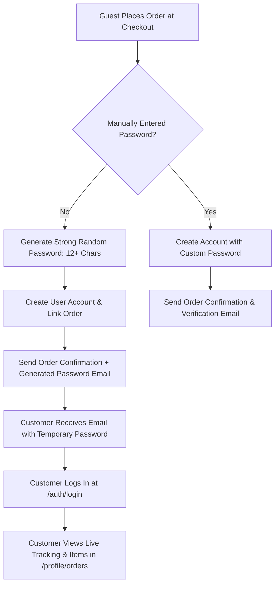
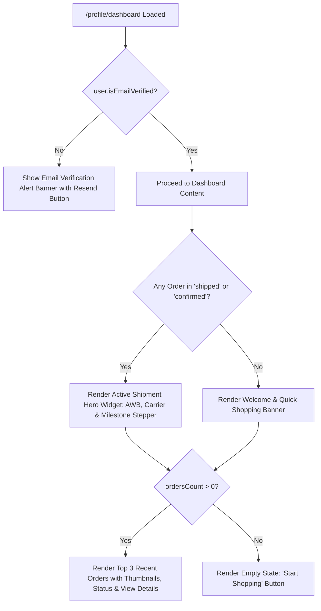
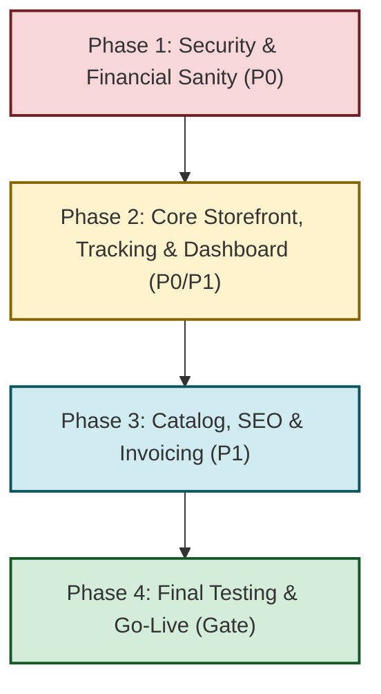

# Kangpack — Production-Grade E-Commerce Feature Checklist & Audit

> **Project:** Kangpack ("Your Smart Workstation")  
> **Repository:** Monorepo (`backend/` Express TypeScript REST API + `frontend/` Next.js 15 App Router)  
> **Deployment Target:** Storefront: `kangpack.in` | API: `api.kangpack.in`  
> **Status:** Pre-Launch Final Audit & Feature Gap Analysis  
> **Last Updated:** September 2026

---

## Table of Contents

1. [Executive Summary](#1-executive-summary)
2. [Production-Grade E-Commerce Standard Feature Matrix](#2-production-grade-e-commerce-standard-feature-matrix)
3. [Kangpack Implementation Status Breakdown](#3-kangpack-implementation-status-breakdown)
   - [A. Fully Implemented & Working](#a-fully-implemented--working)
   - [B. Partially Implemented & Critical Disconnects (Must Fix)](#b-partially-implemented--critical-disconnects-must-fix)
   - [C. Missing / Left to Implement](#c-missing--left-to-implement)
4. [Order Status & Order Tracking: In-Depth Gap Analysis & Blueprint](#4-order-status--order-tracking-in-depth-gap-analysis--blueprint)
5. [Customer Account & User Dashboard: In-Depth Audit & Feature Blueprint](#5-customer-account--user-dashboard-in-depth-audit--feature-blueprint)
6. [Critical Code Locations & Detailed Disconnects](#6-critical-code-locations--detailed-disconnects)
7. [Pre-Go-Live Prioritized Action Plan](#7-pre-go-live-prioritized-action-plan)
8. [Related Documentation](#8-related-documentation)

---

## 1. Executive Summary

This document provides a comprehensive evaluation of the Kangpack e-commerce platform against industry-standard requirements for production-grade online retail systems. Kangpack features a strong architectural foundation (stateless JWT authentication, dual guest/authenticated cart system, dynamic store settings, Cloudflare R2 object storage, and an administrative suite), but several **critical disconnects and security vulnerabilities** must be resolved before opening the site to real customers and live financial transactions.



---

## 2. Production-Grade E-Commerce Standard Feature Matrix

A commercial e-commerce platform requires functionality across **12 core domains**:

| # | Domain | Industry-Standard Production Features |
| :--- | :--- | :--- |
| **1** | **Product & Merchandising** | Multi-image zoom gallery, real-time stock status, variant options (size/color/specs) with dynamic pricing & inventory, product badges, rich descriptions. |
| **2** | **Discovery & Search** | Keyword search with auto-complete/debouncing, multi-facet filtering (category, price range, stock availability), sorting (Price low-to-high, high-to-low, newest, bestsellers), clean pagination or infinite load. |
| **3** | **Cart Experience** | Guest & authenticated cart persistence, slide-out mini-cart drawer, free shipping threshold progress meter, live item total calculations, stock reservation check. |
| **4** | **Checkout & Shipping** | Frictionless 1-page or step-wise checkout, guest checkout with optional inline account creation, address pre-fill from user address book, pincode/zip validation, automated tax (GST) and shipping rates. |
| **5** | **Payments & Gateways** | Multi-channel gateway (Razorpay for Cards, UPI, Netbanking; COD toggle), HMAC signature verification, **webhook listener** for async drop-offs, automatic refund API triggers. |
| **6** | **Orders & Fulfillment** | Chronological order ID generation, order tracking with carrier info & tracking link, automated inventory decrement/restoration on cancel, PDF Tax Invoices with GST breakdown. |
| **7** | **Customer Account & CRM** | Secure authentication (access + refresh tokens), email verification, self-service password reset, order history, address book CRUD, wishlist management. |
| **8** | **Reviews & Social Proof** | Verified buyer reviews, 1-to-5 star rating breakdown, customer review submissions with moderation queue, verified customer badges. |
| **9** | **Promotions & Marketing** | Percentage & flat promo codes with min-order criteria, usage limits, dynamic checkout coupon validation, newsletter subscription integration, abandoned cart triggers. |
| **10** | **Admin Operations** | Comprehensive dashboard (revenue, order counts, status transitions), catalog CRUD, inventory ledger with manual adjustments, coupon engine, contact inquiry inbox. |
| **11** | **SEO & Social Graph** | Server-side dynamic OpenGraph & Twitter preview cards (`og:image`, `og:title`), `sitemap.xml`, configured `robots.txt`, Schema.org / JSON-LD product microdata for Google Rich Snippets. |
| **12** | **Security & Compliance** | Strict CORS whitelisting, rate limiting on auth endpoints, secure token storage, input sanitization, complete legal suite (Terms, Privacy, Refund/Cancellation, Shipping Policy). |

---

## 3. Kangpack Implementation Status Breakdown

### A. Fully Implemented & Working

- [x] **Authentication & Session Security:**
  - Email & password registration with bcrypt password hashing (12 rounds).
  - Dual JWT token architecture: short-lived access token (15m) + long-lived refresh token (7d) stored hashed in MongoDB.
  - Transparent Axios interceptor token auto-refresh on `401 Unauthorized`.
  - Cryptographic email verification tokens with SMTP email delivery.
  - Forgot password / reset password workflow with 60-minute expiring tokens.
  - Customer profile updates, password changes, and address book CRUD (add, edit, delete, set default).
- [x] **Cart Engine:**
  - Dual-cart model: supports authenticated user cart and anonymous guest cart via cookie/header `sessionId`.
  - Automatic guest-to-user cart merging (`mergeCart`) upon customer login or registration.
  - Sliding Cart Drawer with real-time subtotal, free shipping progress bar, and checkout CTA.
  - Dedicated `/cart` page with quantity steppers and line-item deletion.
- [x] **Store Configuration & Settings Engine:**
  - Singleton `Settings` database model.
  - Dynamic Tax toggle and tax percentage calculation (`settings.tax.rate`).
  - Dynamic Shipping rules with customizable fee and free-shipping threshold (`settings.shipping.freeShippingThreshold`).
  - Dynamic Cash on Delivery (COD) enable/disable toggle.
- [x] **Media & Object Storage:**
  - Multi-image uploads handled via Multer and Cloudflare R2 / AWS S3 SDK v3.
  - Automated timestamped unique key generation and public URL generation.
  - Local disk fallback serving from `/uploads`.
- [x] **Administrative Dashboard:**
  - Comprehensive KPI overview (Total Revenue, Total Orders, Order Status breakdown).
  - Product Catalog CRUD with multi-image upload, pricing, compare-at pricing, and stock limits.
  - Category manager with parent-child nesting.
  - Order Management with multi-parameter filtering (status, payment status, payment method, date range, amount range).
  - Fulfillment pipeline: tracking number and logistics carrier assignment with automatic status transition to `shipped`.
  - Inventory ledger with manual stock adjustments and audit reasons.
  - Customer account inspection.
  - Contact Us customer inquiries table with status lifecycle (`unread`, `in-progress`, `resolved`).
- [x] **Backend Hardening & Operational Stack:**
  - Security headers via Helmet, CORS domain whitelisting, Gzip compression, morgan request logging.
  - Express rate limiting (general, auth, and strict endpoints).
  - PM2 multi-process configuration (`ecosystem.config.js`) for standalone Next.js and Express server.

---

### B. Partially Implemented & Critical Disconnects (Must Fix)

These features have partial code in the repository but suffer from broken integration, bypasses, or missing UI connections:

#### 1. Coupon System Disconnect (Backend & Frontend)
- **Backend Issue:** In `backend/src/modules/orders/orders.service.ts` line 200:
  ```typescript
  const discountAmount = 0; // TODO: Apply coupon
  ```
  The order creation service ignores coupons and hardcodes discount to `0`.
- **Frontend Issue:** There is **no coupon input field or apply button** in either `frontend/src/app/(public)/checkout/page.tsx` or `frontend/src/app/(public)/cart/page.tsx`.
- **Result:** Although Admins can create and manage coupons in `/admin/coupons`, customers have no way to use promo codes.

#### 2. Razorpay Signature Verification Bypass
- **Vulnerability:** In `backend/src/common/services/razorpay.service.ts`:
  ```typescript
  if (!signature || signature === 'signature_ok' || razorpayOrderId?.startsWith('order_mock_')) {
    return true;
  }
  if (!key_secret) {
    return true;
  }
  ```
- **Frontend Code:** In `frontend/src/app/(public)/checkout/page.tsx`:
  ```typescript
  razorpaySignature: response.razorpay_signature || "signature_ok"
  ```
- **Result:** Any user can forge an order confirmation by submitting `signature_ok` or an empty signature without paying. Must be strictly guarded against `NODE_ENV === 'production'`.

#### 3. Missing Razorpay Webhook Listener
- **Gap:** There is no webhook endpoint (e.g. `/api/v1/payments/webhook`) handling Razorpay events (`order.paid`, `payment.failed`, `payment.captured`).
- **Result:** If a customer pays via UPI/Cards and their mobile browser tab closes before the frontend calls `/orders/:id/verify-razorpay`, their payment is deducted by the bank, but Kangpack marks the order as unpaid/cancelled.

#### 4. Payment Gateway Refunds Not Wired
- **Gap:** In `backend/src/modules/payments/payments.service.ts` (`processRefund`), the service only updates MongoDB document status. It **never calls `razorpay.payments.refund(...)`**.
- **Result:** When an admin clicks "Refund", no actual money is returned to the buyer's bank card or UPI ID.

#### 5. Product Page Customer Reviews are Static Dummy Text
- **Gap:** `frontend/src/app/(public)/product/[slug]/page.tsx` renders static text:
  ```tsx
  <span className="font-black text-2xl text-brand-brown">4.9/5</span>
  <span className="text-[#8B7E6F] font-bold text-sm tracking-widest uppercase">(120 Reviews)</span>
  ```
- **Result:** Backend has a complete Review model and moderation system in `/admin/reviews`, but the public product detail page does not display actual reviews or offer a review submission form.

#### 6. Product Catalog Filtering & Pagination Missing
- **Gap:** `frontend/src/app/(public)/products/page.tsx` hardcodes `productsApi.getProducts({ page: 1, limit: 12 })`.
  - No search input field.
  - No price filter or sorting dropdown.
  - No pagination or "Load More" controls (products beyond #12 cannot be viewed).
  - Clicking a category in `/categories` navigates to `/products?category=slug`, but `products/page.tsx` ignores query params.

#### 7. Broken Footer Links & Inactive Newsletter
- **Gap:** In `frontend/src/components/home/Footer.tsx`:
  - Links to `/privacy` (actual route is `/privacy-policy`) $\rightarrow$ 404 error.
  - Links to `/shipping` (actual route is `/shipping-policy`) $\rightarrow$ 404 error.
  - Links to `/blog` (route does not exist) $\rightarrow$ 404 error.
  - The newsletter form has `onSubmit={(e) => e.preventDefault()}` and never calls `/api/v1/newsletter`.

#### 8. Hardcoded Credentials & Email Template Discrepancies
- **Gap:** `backend/src/common/services/mail.service.ts` has a hardcoded default password (`const defaultPass = 'K@ngPack#2025!';`).
- Email templates hardcode `"Tax (10%)"` in email HTML rather than displaying dynamic store tax rates.

#### 9. Carrier Name Omission & Tracking API Parameter Mismatch (Order Tracking Bug)
- **Frontend vs Backend Mismatch:** In `frontend/src/features/admin/api.ts` line 137, the admin modal sends `{ trackingNumber, carrier }` via `PUT /orders/:id/tracking`.
- **Backend Controller:** In `backend/src/modules/orders/orders.controller.ts` line 110, the endpoint destructures `{ trackingNumber, shippingMethod } = req.body`. The `carrier` parameter is **completely ignored**.
- **Mongoose Schema Omission:** In `backend/src/database/models/Order.ts`, the field `carrier` **does not exist** in the schema.
- **Result:** Even when an admin types a courier partner like "BlueDart" or "Delhivery" and updates tracking, the carrier name is dropped and never stored in the database. Customer interfaces fall back to showing generic "Standard Shipping".

#### 10. User Dashboard Disconnects & Recent Orders Placeholder Bug
- **Dashboard Placeholder:** In `frontend/src/app/(public)/profile/dashboard/page.tsx` lines 183-198, the "Recent Orders" card **never displays real orders**. It unconditionally renders a static empty-state mockup with a link button, even when the customer has multiple active or completed orders.
- **No Active Shipment Tracker Card:** There is no prominent hero widget showing the customer's currently dispatched order, current milestone (e.g. "Shipped - Out for Delivery"), or carrier AWB on the dashboard overview.
- **Uncalculated Total Spend:** The `totalSpent` metric is initialized to `0` with a comment (`// Total spent would ideally come from a stats endpoint`) and never calculated.
- **Missing Email Verification Banner:** If `user.isEmailVerified` is `false`, the dashboard shows no alert banner reminding the user to verify their email or resend verification.

---

### C. Missing / Left to Implement

| Feature | Production Importance | Effort | Recommended Action |
| :--- | :--- | :--- | :--- |
| **Automatic Guest Account Provisioning & Password Email** | **Critical (P0)** for order privacy & guest tracking | Low | Auto-generate strong password on checkout if not manually set; dispatch credentials via email and enforce login to view order/product details. |
| **User Dashboard Active Shipment Tracker & Real Orders Preview** | **High (P1)** for customer retention & post-purchase UX | Medium | Render active shipment progress hero card and top 3 recent orders on `/profile/dashboard` instead of empty placeholder. |
| **Clickable Courier Tracking Portal URLs** | **High (P1)** for post-purchase customer experience | Low | Map carrier names (BlueDart, Delhivery, DTDC, India Post) to dynamic tracking URLs with one-click redirection. |
| **Customer Self-Service Order Cancellation** | **High (P1)** to reduce support tickets | Low | Add "Cancel Order" button in user's Order Details Drawer for `pending` or `confirmed` orders. |
| **PDF Tax Invoices** | **Mandatory (P1)** for Indian retail & GST compliance | Medium | Generate downloadable PDF invoices (with GSTIN, HSN codes, tax breakdown) for customer profile and admin. |
| **SEO Dynamic Metadata** | **High (P1)** for social sharing (WhatsApp/Twitter) | Low | Refactor `product/[slug]/page.tsx` or wrap in a Server Component using Next.js `generateMetadata`. |
| **XML Sitemap & robots.txt** | **High (P1)** for Google indexing | Low | Create `app/sitemap.ts` querying dynamic product slugs; update `public/robots.txt` to remove dummy domains. |
| **Abandoned Order Stock Release** | **Medium (P2)** to prevent phantom out-of-stock | Medium | Scheduled worker to auto-cancel pending Razorpay orders after 30 minutes and restore inventory. |
| **Global Error Boundary (`error.tsx`)** | **Medium (P2)** for UX reliability | Low | Add Next.js `app/error.tsx` with branded recovery UI and retry actions. |
| **Product Variants Picker** | **Medium (P2)** for multi-size/color products | Medium | Add variant selection radio/chips updating price and stock in product page UI. |

---

## 4. Order Status & Order Tracking: In-Depth Gap Analysis & Blueprint

Post-booking order visibility is the single most critical driver of customer trust, repeat purchases, and reducing "Where Is My Order?" (WISMO) support queries.

### Guest Checkout & Privacy Architecture (Mandatory Authentication for Order Details)

> [!IMPORTANT]
> **Strict Security & Privacy Principle:**
> Guest users **must log in to view their product details, shipping address, invoices, and tracking milestones**. 
> Order details will **not** be exposed over an unauthenticated public URL.

To provide zero-friction checkout while maintaining strict account privacy:
1. **Automatic Account Provisioning:** If a guest user places an order without manually checking "Create an account" or providing a password, Kangpack **automatically generates a cryptographically strong, random password** (12+ characters containing uppercase, lowercase, numbers, and symbols).
2. **Account Linking:**
   - If the guest email is new: The system automatically registers a `User` account, hashes the generated password with bcrypt, and attaches the order to `order.customer = newUser._id`.
   - If the guest email already exists in the database: The system attaches the order to the existing customer account without creating a duplicate.
3. **Password & Credential Dispatch:** The backend immediately sends an automated transactional email (`Your Kangpack Account Details`) containing the customer's email, the generated strong password, and an account verification link.
4. **Login Requirement for Tracking:** When the customer wishes to track their package or view booked product details, they log in using the credentials sent to their email. Once logged in, their full order history, live carrier tracking, and order actions are available in **`/profile/orders`**.



---

### Current Implementation State: User End vs. Admin End

| Order Tracking Feature | Admin End Status | User End Status (Logged-in) | Guest Buyer Experience | Gap / Required Implementation |
| :--- | :--- | :--- | :--- | :--- |
| **View Live Order Status** | ✅ **Working:** Table & detail drawer with color badges. | ✅ **Working:** In `/profile/orders` with badges. | ⚠️ **Auto-Account Needed:** Must log in with emailed credentials. | Auto-generate strong password on checkout if not provided. |
| **Status Progression** | ✅ **Working:** Can transition Pending $\rightarrow$ Confirmed $\rightarrow$ Processing $\rightarrow$ Shipped $\rightarrow$ Delivered $\rightarrow$ Cancelled. | 👁️ **Read-Only:** Multi-step timeline updates dynamically. | 👁️ **Protected:** Visible in `/profile/orders` after login. | Working as designed once logged in. |
| **Courier / Carrier Partner** | ⚠️ **Broken:** Admin inputs carrier, but backend drops it. | ⚠️ **Broken:** Always shows fallback "Standard Shipping". | ⚠️ **Broken:** Falls back to standard shipping. | **Schema & Controller Bug:** Add `carrier` to `Order.ts` schema. |
| **Tracking Number (AWB)** | ✅ **Working:** Admin enters & saves AWB. | ✅ **Working:** Displays with copy button. | 👁️ **Protected:** Visible after logging in. | Working in user drawer. |
| **Clickable Courier URL** | ❌ **Missing:** Admin cannot preview courier link. | ❌ **Missing:** Only displays raw string; no link to BlueDart/Delhivery. | ❌ **Missing:** Raw string only. | Add dynamic courier URL resolver. |
| **Order Cancellation** | ✅ **Working:** Admin can cancel and stock is restored. | ❌ **Missing:** No cancel button in user drawer. | ❌ **Missing:** No cancel button. | Add cancel button for pending orders. |
| **Credential & Status Emails** | ✅ **Working:** Dispatches emails on `shipped`, `delivered`, `cancelled`. | ✅ **Working:** Received in inbox. | ⚠️ **Partial:** Email template exists in `MailService`, but needs auto-trigger on guest order. | Wire `sendAccountCreatedEmail` on default guest checkout. |

---

### Step-by-Step Implementation Blueprint

#### Step 1: Automatic Guest Account Creation with Strong Password (Backend)
Update `backend/src/modules/orders/orders.service.ts` in `createOrder`:
```typescript
// If no logged-in user, handle automatic account provisioning
let finalUserId = userId;
if (!userId) {
  const existingUser = await User.findOne({ email: data.email.toLowerCase().trim() });
  if (existingUser) {
    // Link to existing account
    finalUserId = existingUser._id.toString();
  } else {
    // Determine password: use manual password if provided, else generate strong password
    let plainPassword = data.password;
    const isAutoGenerated = !data.createAccount || !plainPassword;

    if (isAutoGenerated) {
      // Generate cryptographically strong password (e.g. Kp#9xL2$vM8q)
      plainPassword = PasswordUtils.generateStrongPassword();
    }

    const hashedPassword = await PasswordUtils.hash(plainPassword!);
    const verificationToken = crypto.randomBytes(32).toString('hex');
    const hashedVerificationToken = crypto.createHash('sha256').update(verificationToken).digest('hex');

    const newUser = new User({
      email: data.email.toLowerCase().trim(),
      password: hashedPassword,
      firstName: data.shippingAddress.firstName,
      lastName: data.shippingAddress.lastName,
      phone: data.phone || data.shippingAddress.phone,
      role: 'user',
      isEmailVerified: false,
      emailVerificationToken: hashedVerificationToken,
    });

    await newUser.save();
    finalUserId = newUser._id.toString();

    // Send account creation email with temporary password & verification link
    const verificationUrl = `${env.FRONTEND_URL}/auth/verify-email?token=${verificationToken}`;
    MailService.sendAccountCreatedEmail(newUser.email, plainPassword!, verificationUrl)
      .catch(err => console.error('[OrderService] Failed to send account creation email:', err));
  }
}
```

#### Step 2: Strong Password Generator Utility (Backend)
Add to `backend/src/common/utils/password.utils.ts`:
```typescript
public static generateStrongPassword(length: number = 14): string {
  const uppers = "ABCDEFGHJKLMNPQRSTUVWXYZ";
  const lowers = "abcdefghijkmnopqrstuvwxyz";
  const numbers = "23456789";
  const symbols = "!@#$%^&*";
  const all = uppers + lowers + numbers + symbols;

  // Guarantee at least one of each category
  let password = [
    uppers[crypto.randomInt(0, uppers.length)],
    lowers[crypto.randomInt(0, lowers.length)],
    numbers[crypto.randomInt(0, numbers.length)],
    symbols[crypto.randomInt(0, symbols.length)],
  ];

  for (let i = 4; i < length; i++) {
    password.push(all[crypto.randomInt(0, all.length)]);
  }

  // Shuffle the characters
  return password.sort(() => 0.5 - Math.random()).join("");
}
```

#### Step 3: Fix Carrier Schema & Fulfillment Pipeline (Backend)
1. In `backend/src/database/models/Order.ts`:
   ```typescript
   // Add to IOrder interface:
   carrier?: string;
   // Add to orderSchema:
   carrier: { type: String, trim: true },
   ```
2. In `backend/src/modules/orders/orders.controller.ts`:
   ```typescript
   public static addTrackingNumber = asyncHandler(async (req: AuthenticatedRequest, res: Response) => {
     const { trackingNumber, carrier, shippingMethod } = req.body;
     const order = await OrdersService.addTrackingNumber(
       req.params.id,
       trackingNumber,
       carrier || shippingMethod
     );
     res.status(HTTP_STATUS.OK).json(ResponseUtils.success('Tracking number added successfully', order));
   });
   ```

#### Step 4: Checkout Confirmation (Step 4) UX Update (Frontend)
In `frontend/src/app/(public)/checkout/page.tsx`:
- When an order is completed by a guest:
  - Display an informative security box:
    ```tsx
    <div className="p-4 rounded-2xl bg-amber-50 border border-amber-200 text-amber-900 text-xs sm:text-sm">
      <p className="font-bold mb-1">Account Created For Your Order</p>
      <p>
        To track your package and view your product details, we have emailed your 
        temporary login password to <strong>{orderEmail}</strong>.
      </p>
    </div>
    ```
  - Primary button: **"Log In to Track Order"** linking to `/auth/login?redirect=/profile/orders`.

#### Step 5: Clickable Courier Tracking Link & Cancel Order Button (Frontend)
In `frontend/src/features/admin/components/OrderDetailsModal.tsx`:
1. **Courier Redirect Button:**
   When `order.trackingNumber` is present, display a button **"Track on Courier Site"** linking to BlueDart, Delhivery, DTDC, India Post, or Shiprocket based on `order.carrier`.
2. **Customer Pre-Shipment Order Cancellation:**
   If `!isAdmin` and `order.status === 'pending' || order.status === 'confirmed'`:
   Display a **"Cancel Order"** button with confirmation modal, calling `api.post(`/orders/${order.id}/cancel`)`.

---

## 5. Customer Account & User Dashboard: In-Depth Audit & Feature Blueprint

The User Dashboard (`/profile/dashboard`) serves as the central hub for authenticated buyers to manage their purchases, active shipments, personal information, and store interactions.

### Current Implementation State vs. Production Standard

```
User Profile Route Hierarchy:
/profile
├── /dashboard        ──> Overview metrics, recent orders card, quick links
├── /profile          ──> Personal details form (name, email, phone) & password change
├── /orders           ──> Full order history list & OrderDetailsModal
├── /addresses        ──> Saved delivery address book (CRUD)
└── /wishlist         ──> Saved wishlist items with "Add to Cart"
```

| Dashboard Component / Feature | Current Codebase Status | Production Requirement | Action Required |
| :--- | :--- | :--- | :--- |
| **Welcome & Personalization Header** | ✅ **Working:** Displays `Welcome back, {user.firstName}!` with "Browse Products" and "View Cart" shortcuts. | Branded, personalized greeting. | Keep and enhance. |
| **Total Orders Metric** | ✅ **Working:** Fetched from `api.get('/orders?limit=1')` via `pagination.total`. | Accurate count of all customer orders. | Ready. |
| **Wishlist Items Metric** | ✅ **Working:** Connected to `useWishlist().wishlist.length`. | Live count of saved items. | Ready. |
| **Saved Addresses Metric** | ✅ **Working:** Connected to `user?.addresses?.length`. | Live count of saved delivery locations. | Ready. |
| **Account Status Metric** | ⚠️ **Static:** Hardcoded string `"Active"`. | Reflects actual account state (`Active`, `Unverified`, `Suspended`). | Derive from `user.isEmailVerified`. |
| **Total Spent Metric** | ❌ **Unimplemented:** Hardcoded `0` with comment `// Total spent would ideally come from a stats endpoint`. | Display cumulative spend in ₹ across delivered/active orders. | Aggregate order totals or fetch from stats. |
| **Recent Orders Section** | 🚨 **CRITICAL BUG / PLACEHOLDER:** `frontend/src/app/(public)/profile/dashboard/page.tsx:183-198` **never displays real orders**. It unconditionally renders a static empty-state illustration even when the customer has 10+ orders! | Render top 3 recent orders with product thumbnails, order date, total price, status badge, and "View Details" action. | Fix data binding & render real recent order cards. |
| **Active Shipment Hero Tracker** | ❌ **Missing:** No live shipment banner on dashboard overview. | Prominent card showing latest order in transit (`shipped` or `out for delivery`) with milestone progress stepper, carrier name, tracking AWB, and direct courier tracking link. | Implement `ActiveShipmentCard` at top of dashboard. |
| **Email Verification Banner** | ❌ **Missing:** No alert if email is unverified. | If `user.isEmailVerified === false`, show warning banner with "Resend Verification Email" button. | Add verification banner connected to `/auth/resend-verification`. |
| **1-Click "Buy Again" / Reorder** | ❌ **Missing:** User must manually re-search and add products. | "Buy Again" button on past orders that pushes items directly back into the cart. | Add reorder handler to cart context. |
| **Default Address Shortcut** | ❌ **Missing:** Addresses only accessible via secondary tab. | Quick preview card of default shipping address on dashboard with "Change" button. | Add default address card in Quick Access sidebar. |

---

### Step-by-Step User Dashboard Fix & Enhancement Blueprint



#### Step 1: Fix Recent Orders Placeholder Bug in Dashboard
In `frontend/src/app/(public)/profile/dashboard/page.tsx`:
1. Fetch latest 3 orders:
   ```typescript
   const [recentOrders, setRecentOrders] = useState<any[]>([]);
   const [activeShipment, setActiveShipment] = useState<any>(null);
   const [isLoadingOrders, setIsLoadingOrders] = useState(true);

   useEffect(() => {
     const loadDashboardOrders = async () => {
       try {
         setIsLoadingOrders(true);
         const res = await api.get('/orders?limit=3&sort=-createdAt');
         if (res.data.success) {
           const orders = res.data.data || [];
           setRecentOrders(orders);
           setOrdersCount(res.data.pagination?.total || orders.length);
           
           // Calculate total spent
           const spent = orders.reduce((sum: number, o: any) => sum + (o.totalAmount || 0), 0);
           setTotalSpent(spent);

           // Locate active in-transit order
           const active = orders.find((o: any) => o.status === 'shipped' || o.status === 'processing' || o.status === 'confirmed');
           if (active) setActiveShipment(active);
         }
       } catch (err) {
         console.error('Failed to load dashboard orders:', err);
       } finally {
         setIsLoadingOrders(false);
       }
     };
     loadDashboardOrders();
   }, []);
   ```
2. Replace static lines 183-198 with dynamic order items or clean empty state when `recentOrders.length === 0`.

#### Step 2: Implement Active Shipment Tracker Hero Widget
Display at the top of the dashboard when `activeShipment` is present:
- **Order Number & Status Badge** (e.g. `Shipped`, `Confirmed`).
- **Milestone Stepper:** Ordered $\rightarrow$ Confirmed $\rightarrow$ Shipped $\rightarrow$ Out for Delivery $\rightarrow$ Delivered.
- **Carrier & Tracking Number:** e.g. `BlueDart - BLUEDART987654` with 1-click external tracking link.
- **Estimated Delivery / Shipped Date**.
- **CTA:** "View Order Details" opening `OrderDetailsModal`.

#### Step 3: Email Verification Alert Banner
When `user && !user.isEmailVerified`:
- Banner placed directly below the welcome header:
  ```tsx
  <div className="p-4 rounded-2xl bg-amber-500/10 border border-amber-500/20 flex flex-col sm:flex-row items-start sm:items-center justify-between gap-3 text-amber-900">
    <div className="flex items-center gap-2">
      <AlertTriangle className="h-5 w-5 text-amber-600 shrink-0" />
      <p className="text-sm font-medium">
        Your email is not verified yet. Please verify your email to ensure secure account access and notifications.
      </p>
    </div>
    <Button size="sm" variant="outline" className="border-amber-300 text-amber-800 hover:bg-amber-100 shrink-0">
      Resend Verification
    </Button>
  </div>
  ```

---

## 6. Critical Code Locations & Detailed Disconnects

```
backend/
├── src/
│   ├── database/
│   │   └── models/
│   │       └── Order.ts
│   │           └── Carrier field missing in schema (drops courier name on tracking update)
│   ├── modules/
│   │   ├── orders/
│   │   │   ├── orders.controller.ts
│   │   │   │   └── Line 110: addTrackingNumber destructures { trackingNumber, shippingMethod } instead of carrier
│   │   │   └── orders.service.ts
│   │   │       ├── Line 200: "const discountAmount = 0; // TODO: Apply coupon"
│   │   │       └── Line 166: Stock decremented immediately on createOrder (needs TTL expiry)
│   │   ├── payments/
│   │   │   └── payments.service.ts
│   │   │       └── Line 137: processRefund updates DB only, no razorpay.payments.refund call
│   │   └── coupons/
│   │       └── coupons.service.ts
│   │           └── Line 87: validateCoupon exists but uncalled by checkout
│   └── common/
│       └── services/
│           ├── razorpay.service.ts
│           │   └── Line 85: Bypass returns true on "signature_ok" or empty signature
│           └── mail.service.ts
│               ├── Line 13: Hardcoded fallback password 'K@ngPack#2025!'
│               └── Line 213: Hardcoded "Tax (10%)" in order confirmation email
frontend/
└── src/
    ├── app/
    │   ├── (public)/
    │   │   ├── profile/dashboard/page.tsx
    │   │   │   ├── Lines 183-198: Recent Orders card unconditionally renders empty-state placeholder
    │   │   │   ├── Line 35: totalSpent hardcoded as 0 in state
    │   │   │   └── Missing Active Shipment Tracker widget & Email Verification banner
    │   │   ├── checkout/page.tsx
    │   │   │   ├── Line 333: Fallback test key "rzp_test_SDt3Oq2hqQz8jt"
    │   │   │   ├── Line 349: Fallback "signature_ok" sent to backend
    │   │   │   ├── No coupon code input or validation
    │   │   │   └── Step 4 confirmation must guide guests to log in with auto-emailed password
    │   │   ├── product/[slug]/page.tsx
    │   │   │   ├── Line 1: "use client" blocks server-side generateMetadata
    │   │   │   └── Line 580: Reviews section is static dummy text
    │   │   └── products/page.tsx
    │   │       └── Line 124: Hardcoded limit 12, ignores category query param, no search/filter
    └── components/
        └── home/
            ├── Navbar.tsx
            │   └── No "Track Order" navigation link
            └── Footer.tsx
                ├── Line 33: Link to /privacy (404, should be /privacy-policy)
                ├── Line 34: Link to /shipping (404, should be /shipping-policy)
                ├── Line 40: Link to /blog (404, page does not exist)
                ├── Line 42: Newsletter onSubmit e.preventDefault() without API call
                └── No "Track Order" navigation link
```

---

## 7. Pre-Go-Live Prioritized Action Plan



### Phase 1: Security & Financial Sanity (P0 - Immediate)
1. **Remove Payment Signature Bypass:** Ensure `RazorpayService.verifySignature` requires live signature validation and live secret in production.
2. **Purge Hardcoded Credentials:** Remove hardcoded credentials from `mail.service.ts` and ensure environment variables are enforced via Zod `env.ts`.
3. **Implement Razorpay Webhook:** Add `/api/v1/payments/webhook` with HMAC verification to handle asynchronous payment captures.

### Phase 2: Core Storefront, Tracking & User Dashboard Workflows (P0 / P1)
1. **Automatic Guest Account Provisioning & Password Email:**
   - In `backend/src/modules/orders/orders.service.ts`, generate strong 14-char password when guest checks out without password.
   - Dispatch welcome credentials email with verification link.
   - Step 4 checkout notice informing guest to check email for temporary credentials.
2. **Fix Carrier Tracking Data Pipeline:**
   - Add `carrier` field to `Order.ts` schema and update `orders.controller.ts`.
   - Add clickable tracking URLs (BlueDart, Delhivery, DTDC, India Post) in user order drawer.
   - Add "Cancel Order" button in user order modal for pre-dispatch orders.
3. **Fix User Dashboard (`/profile/dashboard`):**
   - Replace static Recent Orders placeholder with real top 3 orders.
   - Implement Active Shipment Tracker Hero Card for in-transit orders.
   - Add Email Verification Alert Banner with resend action.
4. **Connect Coupons:** Add coupon input field in checkout, validate against `/api/v1/coupons/validate`, and compute discounts in `orders.service.ts`.
5. **Fix Broken Footer Navigation:** Update footer links to valid routes (`/privacy-policy`, `/shipping-policy`) and remove dead `/blog` link.
6. **Wire Newsletter:** Connect footer subscription form to `POST /api/v1/newsletter`.

### Phase 3: Catalog, SEO & Invoicing (P1)
1. **Catalog Enhancements:** Add category filtering, search input, and pagination to `/products`.
2. **Product Page Dynamic Metadata:** Enable Next.js OpenGraph and Twitter card metadata for dynamic social sharing previews.
3. **Tax Invoice Generation:** Implement PDF invoice download in order history.
4. **Product Reviews Integration:** Connect real review submissions and star breakdowns to `/product/[slug]`.

### Phase 4: Final Testing Execution (Gate)
- Execute the complete test suite outlined in **[`docs/FINAL_PRE_LAUNCH_TESTING_CHECKLIST.md`](./FINAL_PRE_LAUNCH_TESTING_CHECKLIST.md)**.
- Secure sign-offs across development, QA, and business leads before public traffic routing.

---

## 8. Related Documentation

- 📋 **[Final Pre-Launch Testing Checklist](./FINAL_PRE_LAUNCH_TESTING_CHECKLIST.md)**: 14 step-by-step testing scenarios, test matrices, and go-live verification protocol.
- 🗺️ **[Phasewise Implementation Plan](./PHASEWISE_IMPLEMENTATION_PLAN.md)**: Phase 1 blockers, Phase 2 post-launch, Phase 3 scaling milestones.
- 🚀 **[Deployment Guide](../DEPLOYMENT_AWS.md)**: Server setup, Nginx reverse proxy configuration, PM2 management, and SSL provisioning.
- 📖 **[Project Readme](../README.md)**: Architecture overview, local development setup, and API specifications.

